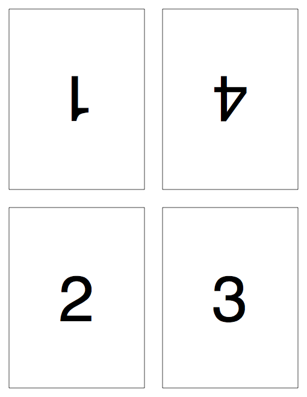
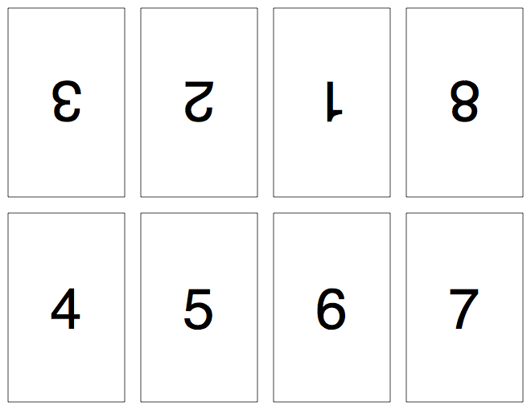

# PDF::Impose

`PDF::Impose` is a utility and library for reformatting PDF files, in order to lay out multiple pages of the original document on a single page. The original pages are arranged in such a way that the new page may be folded and cut to produce a _signature_--a small booklet in which the pages are in the expected order. In this way, an existing PDF can be printed, folded, cut, and bound into a handmade book or booklet.

This process of laying out pages in this way is called [_imposition_](https://en.wikipedia.org/wiki/Imposition).

## Installation

`PDF::Impose` and its dependencies may be installed via RubyGems:

    $ gem install pdf-impose

## Usage

The easiest way to use `PDF::Impose` is via the command-line tool:

    $ impose -h
    Usage: impose [options] <input.pdf>
      -l, --layout LAYOUT    The form to use when laying out pages for imposition.
                             Default is "quarto".
                             (Specify "list" to see all available forms.)
      -o, --orient ORIENT    How each sheet should be oriented.
                             Possible options are "portrait" or "landscape".
                             Default is "portrait".
      -f, --forms COUNT      The number of forms to use for each signature.
                             Default is dependent on the form used.
      -d, --dimensions DIM   Either the name of a paper size, or a WxH (width/height)
                             specification. Measurements must be in points.
                             Default is "LETTER".
                             (Specify "list" to see all named paper sizes.)
      -m, --margin SIZE      The minimum margin (in points) for the chosen form.
                             Default is 36 points.
      -s, --start PAGE       The page at which to start imposing.
                             Default is 1.
      -e, --end PAGE         The page at which to stop imposing.
                             Default is the last page of the source document.
      -M, --[no-]marks       Whether or not to include registration marks.
                             Default is to include registration marks.
      -O, --output FILENAME  The name of the file to which to write the resulting PDF.
                             Default is the original filename with "imposed" appended.
      -h, --help             This help screen.

To impose an existing PDF in quarto on A4 sheets, the following would suffice:

    $ impose -l quarto -d A4 my-document.pdf

This would produce a new PDF called `my-document-imposed.pdf`.

## Default Layouts and Forms

The process of imposition takes a source document and lays out its pages in a particular form. The form used depends on how many pages you want to fit on a single sheet, and how many times you want to fold the paper to produce a signature.

`PDF::Impose` supports several common imposition forms, which should satisfy most needs. If you need a specific layout, though, it is not hard to define a custom imposition form. (See the "minibook" example in this repository.)

The following forms are supported by default.

### Four-page card-fold (`card-fold4`)

The four-page card fold takes a four-page document and lays out the pages on a single sheet in the following order:

When printed, the page can be folded in half twice to make a simple pamphlet of the original four pages. This form works best with the sheet in portrait orientation.

    $ impose -o portrait -l card-fold4 document.pdf
    # produces document-imposed.pdf

### Eight-page card-fold (`card-fold8`)

The eight-page card fold takes an eight-page document and lays out the pages on a single sheet in the following order:

When printed, the page can be folded in half three times to make a simple pamphlet of the original eight pages. This form works best with the sheet in landscape orientation.

    $ impose -o landscape -l card-fold8 document.pdf
    # produces document-imposed.pdf

### Folio (`folio`)

This form applies two pages to each side of a sheet of paper, in the following order:

Recto (front):

Verso (back):

When printed, the page can be folded in half to produce a simple pamphlet of four pages. For documents of more than four pages, multiple sheets can be folded and nested inside each other to form a signature. By default, up to eight forms (four sheets, one form for each side of the sheet) will be treated as a single signature. For documents of more than eight pages, multiple signatures will be produced, though you can control how many forms to include in a signature with the `--forms` switch.

This form works best with landscape orientation.

    $ impose -o landscape -l folio document.pdf
    # produces document-imposed.pdf

### Quarto (`quarto`)

This form applies four pages to each side of a sheet of paper, in the following order:

Recto (front):

Verso (back):

When printed, the page can be folded in half twice to produce a simple pamphlet of eight pages. For documents of more than eight pages, multiple sheets can be folded and nested inside each other to form a signature. By default, up to four forms (two sheets, one form for each side of the sheet) will be treated as a single signature. For documents of more than sixteen pages, multiple signatures will be produced, though you can control how many forms to include in a signature with the `--forms` switch.

This form works best with portrait orientation.

    $ impose -o portrait -l quarto document.pdf
    # produces document-imposed.pdf

### Sexto (`sexto`)

This form applies six pages to each side of a sheet of paper, in the following order:

Recto (front):

Verso (back):

When printed, the page can be folded three times to produce a simple pamphlet of twelve pages. For documents of more than twelve pages, multiple sheets can be folded and nested inside each other to form a signature. By default, up to four forms (two sheets, one form for each side of the sheet) will be treated as a single signature. For documents of more than twenty-four pages, multiple signatures will be produced, though you can control how many forms to include in a signature with the `--forms` switch.

This form is awkward to apply when dealing with standard letter-sized pages, but for non-standard page sizes it may work very well.

    $ impose -l sexto document.pdf
    # produces document-imposed.pdf

### Octavo (`octavo`)

This form applies eight pages to each side of a sheet of paper, in the following order:

Recto (front):

Verso (back):

When printed, the page can be folded three times to produce a simple pamphlet of sixteen pages. For documents of more than sixteen pages, multiple sheets can be folded and nested inside each other to form a signature. By default, two forms (one sheet, one form for each side of the sheet) will be treated as a single signature. For documents of more than sixteen pages, multiple signatures will be produced, though you can control how many forms to include in a signature with the `--forms` switch.

This form works well in landscape orientation.

    $ impose -o landscape -l octavo document.pdf
    # produces document-imposed.pdf

### Duodecimo (`duodecimo`)

This form applies twelve pages to each side of a sheet of paper, in the following order:

Recto (front):

Verso (back):

When printed, the bottommost strip can be separated and folded in quarto, while the remaining octavo is folded per octavo. The octavo is then nested inside the quarto to form the signature. For documents of more than twenty-four pages, multiple signatures will be produced, though you can control how many forms to include in a signature with the `--forms` switch.

This form is awkward to apply when dealing with standard letter-sized pages, but for non-standard page sizes it may work very well.

    $ impose -l duodecimo document.pdf
    # produces document-imposed.pdf

### Duodecimo (Quarto-inside) (`duodecimo-i`)

This form applies twelve pages to each side of a sheet of paper, in the following order:

Recto (front):

Verso (back):

When printed, the bottommost strip can be separated and folded in quarto, while the remaining octavo is folded per octavo. The quarto is then nested inside the octavo to form the signature. (Note that this is slightly different than how the `duodecimo` form works!) For documents of more than twenty-four pages, multiple signatures will be produced, though you can control how many forms to include in a signature with the `--forms` switch.

This form is awkward to apply when dealing with standard letter-sized pages, but for non-standard page sizes it may work very well.

    $ impose -l duodecimo-i document.pdf
    # produces document-imposed.pdf

### Duodecimo (Two-Cut) (`duodecimo-2c`)

This form applies twelve pages to each side of a sheet of paper, in the following order:

Recto (front):

Verso (back):

When printed, each strip of four can be separated and folded in quarto, with the quartos nested to form the signature. (Note that this is different than how the `duodecimo` form works!) For documents of more than twenty-four pages, multiple signatures will be produced, though you can control how many forms to include in a signature with the `--forms` switch.

This form is awkward to apply when dealing with standard letter-sized pages, but for non-standard page sizes it may work very well.

    $ impose -l duodecimo-2c document.pdf
    # produces document-imposed.pdf

### Sextodecimo (`sextodecimo`)

This form applies sixteen pages to each side of a sheet of paper, in the following order:

Recto (front):

Verso (back):

When printed, the sheet is cut in half to form two octavos which, when folded, are nested to form the signature.  For documents of more than thirty-two pages, multiple signatures will be produced, though you can control how many forms to include in a signature with the `--forms` switch.

This form works best in portrait mode when used with standard paper sizes.

    $ impose -o portrait -l sextodecimo document.pdf
    # produces document-imposed.pdf

## Author

Jamis Buck <jamis@jamisbuck.org>

## License

This code is released and distributed under the terms of the MIT license. See the associated `MIT-LICENSE` file for details.
